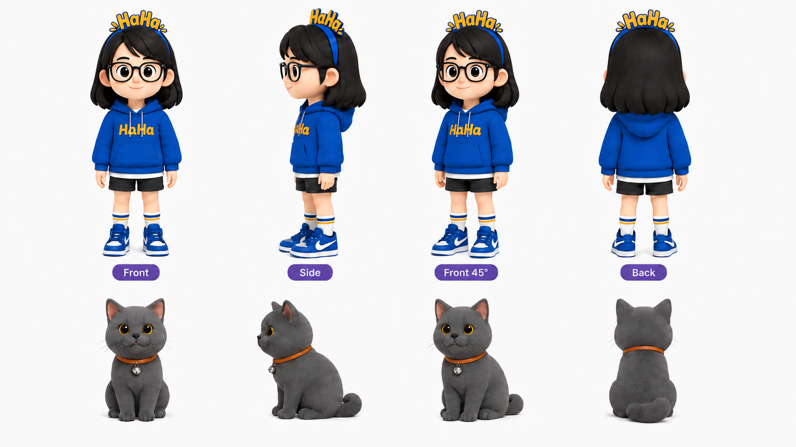
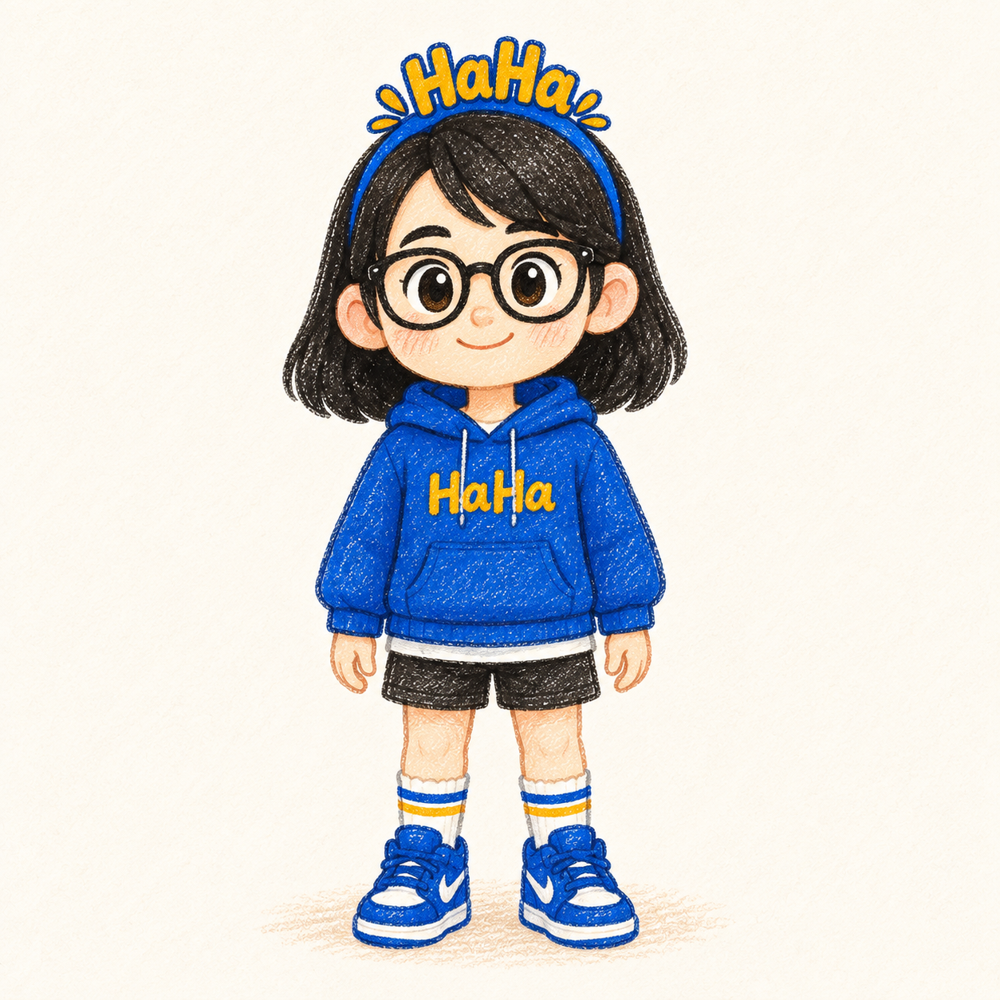
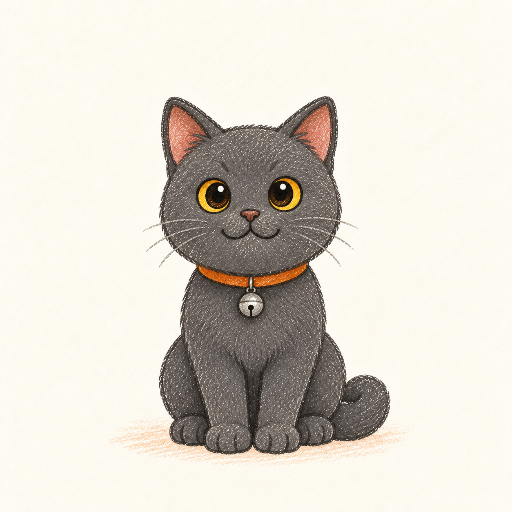
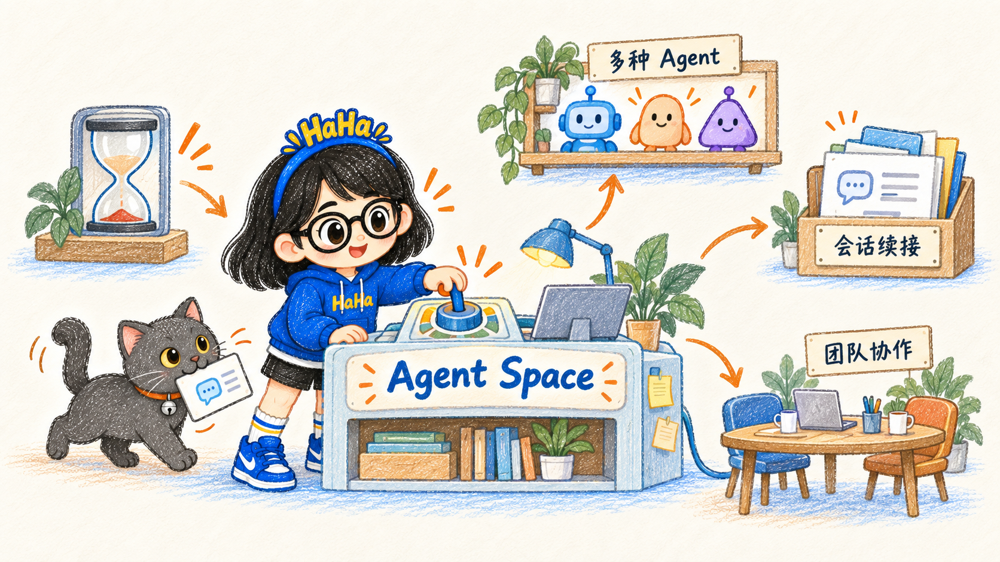

# 配图说明：从身份参考到文章画面

以下四张图承担不同职责。生成时按职责引用，不把一张图里的产品、布局或文字当成每篇文章的固定模板。

## 1. 原始身份参考

**用途**：只核对人物与猫咪的原始识别特征。它的 3D 质感不是目标画风；转成文章配图时，优先保留脸、发型、眼镜、服饰识别点，以及猫咪的毛色与配饰。

## 2. 人物标准图

**用途**：锁定文章配图中的人物身份与蜡笔比例。正文图可更换姿势和表情，但发型、圆框眼镜、蓝黄穿搭与两处 `HaHa` 不应随文章主题变色或消失。人物须亲手操作与文案相关的物件。

## 3. 宠物标准图

**用途**：锁定灰毛、金黄眼睛、橙色项圈与银铃铛。猫咪要分享人物的视线、路径或物件；可以发现漏掉的线索、递送材料、跟随路线或制造轻微阻力。画面中只有一只“坐在旁边”的猫，不能算完成互动。

## 4. 用户认可的文章例图

**这张图说明的文案关系**：额度压力是起点，未完成的工作需要接续，多工具与团队协作是故事中的不同去向。画面中心由人物操作装置，猫咪把会话卡带到装置旁；侧边纸盒、架子和桌面分别回应原文中的负担、工具与协作。短箭头引导阅读顺序，浅暖底和分散的小场景给主体留出空间。

**应继承的设计逻辑**：一个主动作、一个宠物配合动作、1 个主物件、2–3 个有因果的辅助场景；浅暖背景、柔和木棕与蓝色结构、少量橙色路径；统一的蜡笔颗粒、纸板厚边与接地涂鸦。

**不应复制的内容**：Agent Space 名称、价格或额度标签、原工作台、架子布局与任何商业宣称。换文章时，先从新文案找主动作和主物件。

## 文案到配图的示范

| 文案重点 | 人物与猫咪的共同动作 | 主物件与辅助线索 | 画面应让读者明白什么 |
| --- | --- | --- | --- |
| 城市探索中的偶遇 | 人物查看街角地图，猫咪循一颗珠子发现小巷入口 | 地图为主，小店招牌与珠子为辅 | 旅程的价值在沿途发现，而非只完成任务 |
| AI 修改建议导致测试失败 | 人物在桌前比对两张实验卡，猫咪按住失败结果卡 | 对照实验台为主，测试结果与建议纸条为辅 | 先查明原因，再决定是否修改 |
| 项目成本不止订阅费 | 人物把时间卡与费用卡放上同一架天平，猫咪叼来交接清单 | 天平为主，环境准备和复核清单为辅 | 时间与精力也应计入同一本账 |

这些是构图说明，不是已经生成或验收的成图。每次真正生图仍需按当前文案、参考图和用户反馈逐张检查。
